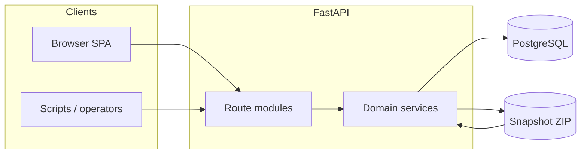

# TallyBadger architecture

This document is the **high-level map** of the system: subsystems, trust boundaries, and the main data paths. It is **decision-oriented**, not a file catalog. Day-to-day conventions, testing expectations, and delivery hygiene live in **[STYLE.md](STYLE.md)**.

## Product shape

TallyBadger is a **double-entry accounting** backend for small rental portfolios, exposed as a **FastAPI** HTTP API, with a **React + TypeScript + Vite** UI under `frontend/`. PostgreSQL holds authoritative ledger and configuration data. See **[README.md](README.md)** for product scope and honest inventory of what is not built yet.

## Subsystems

| Subsystem | Role | Primary locations |
|-----------|------|-------------------|
| **HTTP API** | REST-ish routes, request validation, orchestration | [`src/tallybadger/main.py`](src/tallybadger/main.py), [`src/tallybadger/api/routes/`](src/tallybadger/api/routes/) |
| **Domain / ledger** | Journal rules, posting, invariants | [`src/tallybadger/ledger/`](src/tallybadger/ledger/) |
| **Import rules** | Rule evaluation (including CEL), templates | [`src/tallybadger/import_rules/`](src/tallybadger/import_rules/), [`src/tallybadger/import_templates/`](src/tallybadger/import_templates/) |
| **Persistence** | Database access, connection settings | [`src/tallybadger/db.py`](src/tallybadger/db.py), [`src/tallybadger/core/config.py`](src/tallybadger/core/config.py) |
| **Migrations** | Versioned schema applied in filename order | [`sql/`](sql/) (`NNN_*.sql`), [`src/tallybadger/db_migrations.py`](src/tallybadger/db_migrations.py) |
| **Backup / snapshot** | Portable ZIP of table JSON, export and import | [`src/tallybadger/backup/`](src/tallybadger/backup/), [`src/tallybadger/api/routes/backup.py`](src/tallybadger/api/routes/backup.py) |
| **Frontend** | SPA calling the API | [`frontend/`](frontend/) |
| **Local operations** | Compose-backed DB, API, frontend lifecycle | [`src/tallybadger/tbad.py`](src/tallybadger/tbad.py), [`docker-compose.yml`](docker-compose.yml), [`Makefile`](Makefile) |

## Trust boundaries

- **Clients → API:** All HTTP input is untrusted until validated (Pydantic models, explicit checks). CORS allowed origins come from [`Settings`](src/tallybadger/core/config.py) (`TALLYBADGER_CORS_ALLOWED_ORIGINS` or sensible dev defaults). There is **no application-level auth** in the tree today; treat deployments accordingly.
- **API → database:** Use parameterized queries and transactions; migrations are an operator-controlled, out-of-band change surface.
- **Snapshot files:** Treat exports as **data at rest** that may move between environments. Integrity is described in the format spec (manifest + hashes). Import enforces **`format_version`** and **`schema_version`** alignment with the target database so restores do not silently apply incompatible shapes.

## Important data flows

1. **Ledger operations** — UI or API client sends journal-related requests → route handlers → ledger (and related) services → PostgreSQL under a transaction where invariants require it.
2. **Import rules and CEL** — Evaluation and rule-set APIs run in-process against submitted or stored definitions; details and API surface are documented under `docs/` (see links below).
3. **Backup / restore** — Export reads the database and writes a versioned ZIP per **[docs/backup-snapshot-format.md](docs/backup-snapshot-format.md)**. Import reads the ZIP, validates metadata and members, and applies rows according to export mode and API-chosen restore behaviour. When schema or included tables change, update **snapshot code, integration tests, format documentation, and `format_version`** when the on-wire layout or semantics require it (see [STYLE.md](STYLE.md)).
4. **Migrations and dev seed** — `sql/*.sql` advances schema; `sql/dev_seed.sql` is the checked-in bootstrap dataset for local development. Regenerating the seed after model changes is part of the portable-data story (see [STYLE.md](STYLE.md)).

## Deeper reference (do not duplicate here)

| Topic | Document |
|-------|----------|
| Snapshot ZIP layout, `format_version`, export modes | [docs/backup-snapshot-format.md](docs/backup-snapshot-format.md) |
| Import rules engine scope and API | [docs/import-rules-engine.md](docs/import-rules-engine.md) |
| CEL helpers and functions | [docs/cel-function-reference.md](docs/cel-function-reference.md) |

## When to update this document

Update **ARCH.md** when work **moves or introduces a subsystem boundary**, changes **security or trust assumptions**, adds a **new external integration**, or changes **data lifecycle** (backup, migration, or restore strategy) in a way future readers would still assume the old picture.

**Localized bugfixes** or internal refactors that preserve those boundaries do not require an architecture rewrite; a short PR note such as “no architecture change” is enough.

## Reconciliation notes (issue #75)

Representative modules were checked against this narrative: `src/tallybadger/` (API, ledger, import, backup, config, migrations), `frontend/`, and `sql/`. **Intentional deferrals** called out in the README still apply: for example **end-user auth**, **full bank CSV ingestion**, and some product flows are future work—not contradictions in this file.
