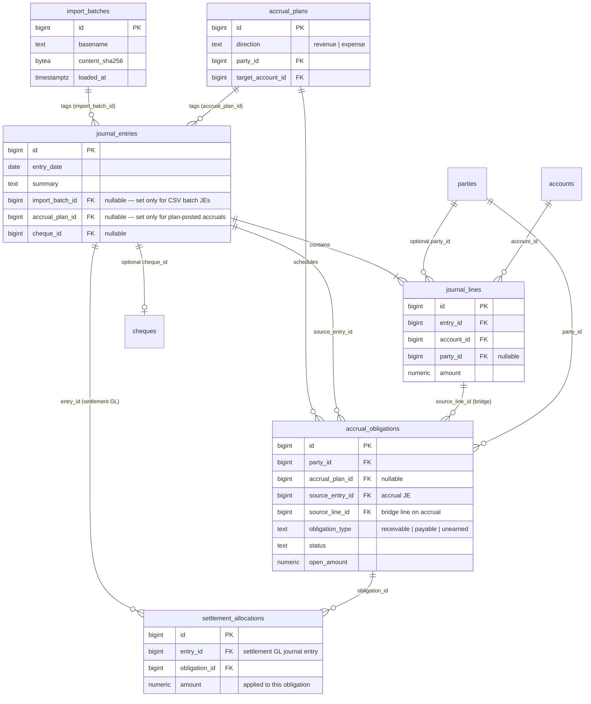
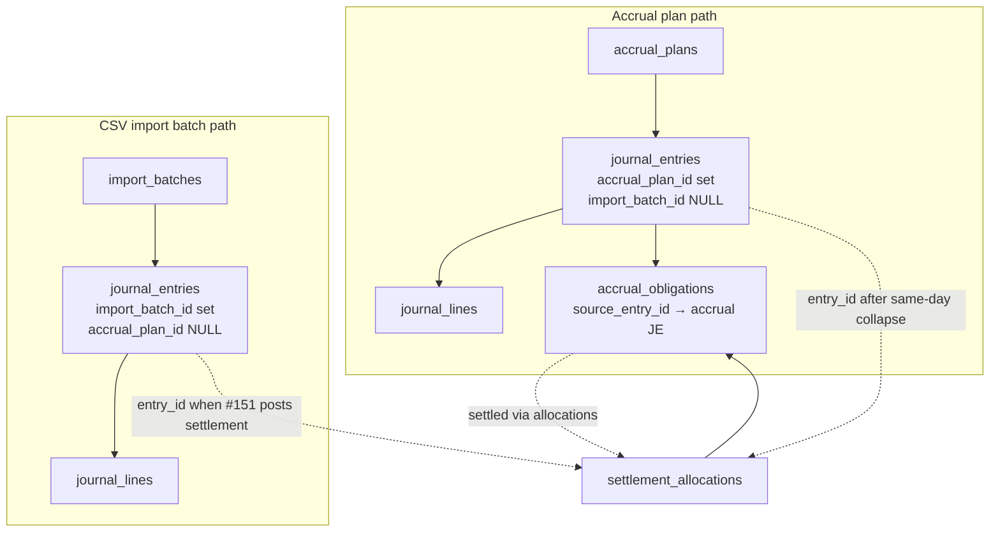
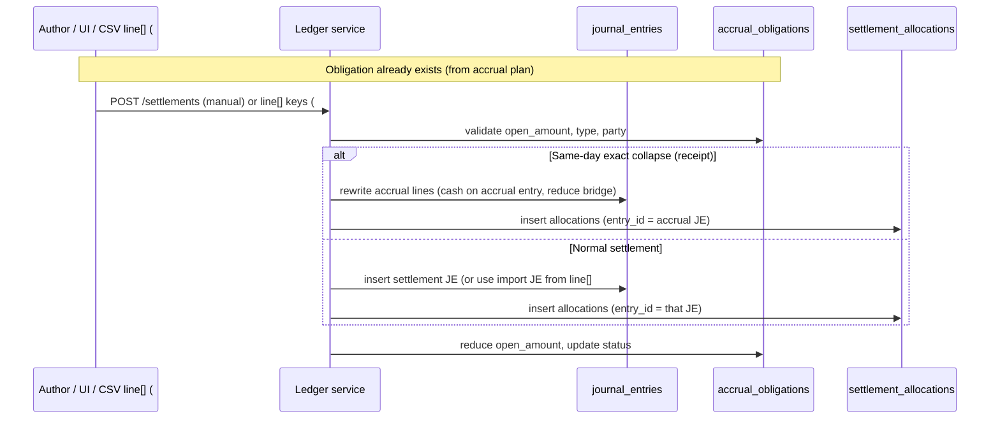
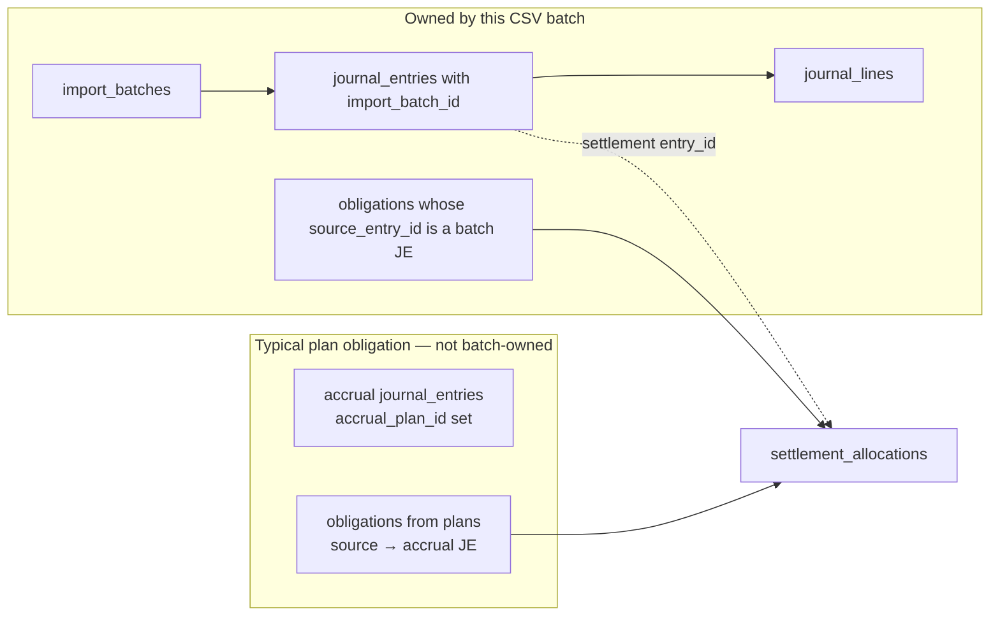

# Ledger data model — journals, obligations, settlements, import batches

This document is the **relationship map** for core ledger tables: how journal entries, accrual obligations, settlement allocations, and CSV import batches connect, and what **unload import batch** can and cannot roll back. It complements **[ARCH.md](../ARCH.md)** (subsystem boundaries) and **[docs/import-rules-engine.md](import-rules-engine.md)** (CSV attribute bags).

Parent workstream: [GitHub #45](https://github.com/brettski74/TallyBadger/issues/45). Settlement model collapsed in [#153](https://github.com/brettski74/TallyBadger/issues/153); CSV `line[]` settlement lands in [#151](https://github.com/brettski74/TallyBadger/issues/151).

---

## Entity-relationship diagram

Each journal entry must have **at least two lines** and **line amounts that sum to zero**; PostgreSQL enforces this at **transaction commit** via deferrable constraint triggers (migration `027`), in addition to application validation in `LedgerService`.

---

## Settlements are allocations grouped by `entry_id`

There is **no** separate settlement header table. A settlement is one or more **`settlement_allocations`** rows that share the same **`entry_id`** — the journal entry that carries the settlement GL (a dedicated settlement JE, the import row's JE once [#151](https://github.com/brettski74/TallyBadger/issues/151) lands, or the accrual JE after same-day collapse).

| Former `settlement_events` column | Where it lives now |
|-----------------------------------|-------------------|
| `party_id` | `accrual_obligations.party_id` (via each allocation) |
| `settlement_type` | Derived from `obligation_type` (`receivable` → receipt, `payable` → payment) |
| `event_date` | `journal_entries.entry_date` for `entry_id` |
| `cash_account_id` | Cash/bank **journal line** on `entry_id` |
| Total cash amount | **Not stored** on allocations — authoritative on journal lines |
| Per-obligation applied amount | `settlement_allocations.amount` |
| `entry_id` | **`settlement_allocations.entry_id`** (required FK) |

**Two amounts that matter:**

1. **Cash on the journal entry** (bank line magnitude) — from `journal_lines`.
2. **Applied to each obligation** — `settlement_allocations.amount` (sum may be **less** than cash on the entry when unapplied cash sits on other journal lines).

One bank movement closing multiple obligations → **multiple allocation rows**, same `entry_id`.

---

## Two ways journal entries enter the ledger

| Origin | Typical `journal_entries` marker | Creates `accrual_obligations`? |
|--------|----------------------------------|--------------------------------|
| **Accrual plan** (`create_accrual_plan`) | `accrual_plan_id` | **Yes** — one per scheduled accrual on the bridge line (ledger **A/R** for `revenue` plans, **A/P** for `expense` plans from settings at post time; [#235](https://github.com/brettski74/TallyBadger/issues/235)). |
| **CSV import** (`create_import_batch_with_entries`) | `import_batch_id` | **No** for plain cash/expense/revenue rows. **Yes** when **`line[]`** includes **`obligation-id`** — see [#151](https://github.com/brettski74/TallyBadger/issues/151). |

An obligation belongs to the **accrual subledger** (`accrual_obligations` + its `source_entry_id` accrual JE). A batch is only the set of journal entries tagged with that batch's `import_batch_id`.

---

## Settlement flow (manual today; CSV `line[]` in #151)

**Manual vs CSV `line[]`:** same `settlement_allocations` / obligation updates. Manual **`POST /settlements`** may create a settlement journal entry or collapse into an accrual entry; CSV import supplies GL via **`line[]`** and reuses that entry (or collapses when eligible) ([#151](https://github.com/brettski74/TallyBadger/issues/151)).

---

## Import batch unload — discovery and scope

`DELETE /import-batches/{id}` (see `unload_import_batch` in `ledger/service.py`):

1. Collect `batch_entry_ids` = all `journal_entries` where `import_batch_id = batch`.
2. **Rollback settlements** by finding `settlement_allocations` where **`entry_id ∈ batch_entry_ids`**, then reversing obligation balances, journal line side effects (receipt/payment same-day collapse rewrites, early receipt/payment reclassification, unapplied unearned/prepaid lines), and deleting allocation rows.
3. **Delete obligations** whose source accrual line/entry is in the batch (batch-created obligations only).
4. **Delete** each batch journal entry (and reopen cheques if needed).
5. **Delete** the `import_batches` row.

### JE handling during settlement rollback

| `journal_entries` marker | On unload |
|--------------------------|-----------|
| `import_batch_id` set (batch JE) | Deleted with the batch (after allocation rollback). |
| `accrual_plan_id` set (plan accrual JE) | **Not deleted** — line mutations reversed; `import_batch_id` cleared if CSV import stamped it during collapse ([#151](https://github.com/brettski74/TallyBadger/issues/151)). |
| Neither (standalone settlement JE) | Deleted when not in `batch_entry_ids` and not a plan accrual. |

### What unload does *not* do (by design)

- **Delete accrual plan journal entries** or plan-created obligations (they are not batch-tagged).
- **Undo manual settlements** whose `entry_id` is not on a batch-tagged journal entry — there is no `DELETE /settlements` API.

Import unload is the **supported rollback path for CSV batch work**. Settlement rollback tests that exercise batch + settlement together belong with [#151](https://github.com/brettski74/TallyBadger/issues/151) / [#152](https://github.com/brettski74/TallyBadger/issues/152) once CSV settlement is implemented.

---

## Accrual plan list filters (`GET /accrual-plans`, #168)

The list endpoint returns `{ "plans": [...], "filter_options": null | {...} }`. Query parameters combine with **AND** semantics; omit a parameter for no constraint on that dimension.

| Parameter | Behaviour |
|-----------|-----------|
| `party_ids`, `target_account_ids` | Multi-value exact match on the plan row |
| `from_date`, `to_date` | Plan `[start_date, end_date]` overlaps the filter range (inclusive) |
| `name` | Case-insensitive POSIX regex (`~*`) on plan `name`; invalid pattern → **422** |
| `settlement_status` | `any` \| `unsettled` \| `open` \| `partially_settled` \| `settled` — plan-level buckets per [#159](https://github.com/brettski74/TallyBadger/issues/159). **Omitted = no filter** (same as `any`). The register UI defaults to `open` on first load. |
| `include_filter_options` | When `true`, adds `filter_options` with distinct `party_ids` and `target_account_ids` from **all** plans (for filter dropdowns), independent of the current filter. |

**Settlement buckets (plan level):**

- **unsettled** — no `settlement_allocations` on any obligation for the plan.
- **open** — at least one obligation with `status` not in `settled`/`reconciled` or `open_amount > 0`.
- **partially_settled** — at least one allocation on the plan’s obligations and the plan is not fully settled.
- **settled** — no obligation with non-terminal status and positive `open_amount` (plans with no obligations match vacuously).

---

## References

- Schema: `sql/007_settlement_workflow.sql`, `sql/024_settlement_allocations_entry_id.sql`, `sql/022_import_batches_and_journal_fk.sql`
- Posting: `LedgerService.record_settlement`, `create_import_batch_with_entries`, `unload_import_batch`
- Snapshot: [docs/backup-snapshot-format.md](backup-snapshot-format.md) (`format_version` **1.6.0** drops `settlement_events.json`)
